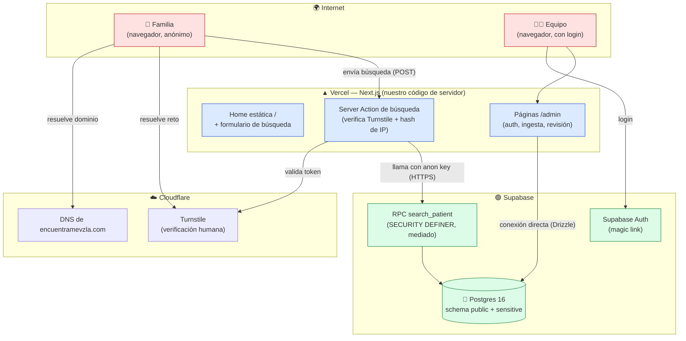
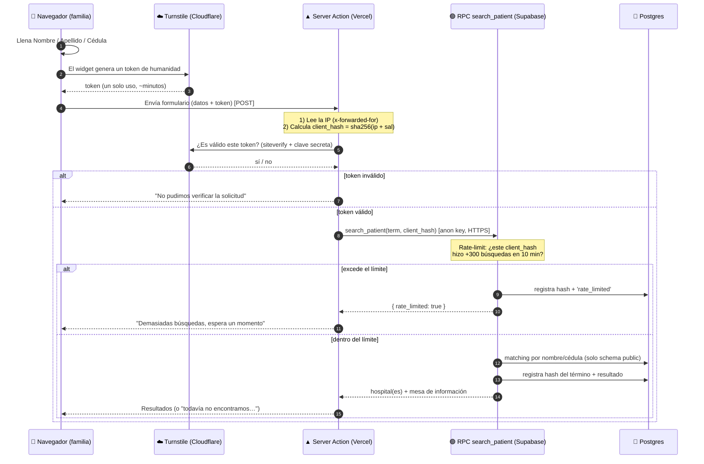
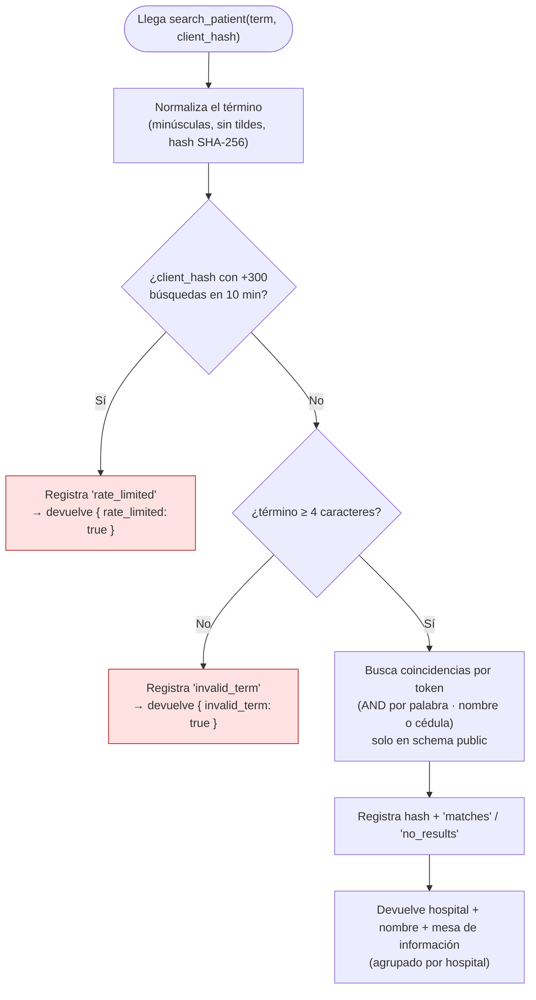
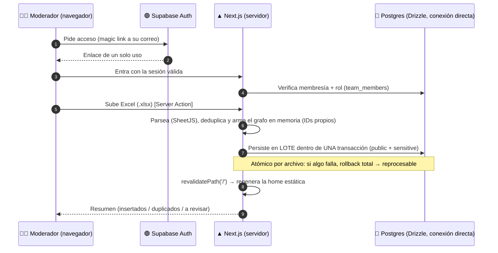
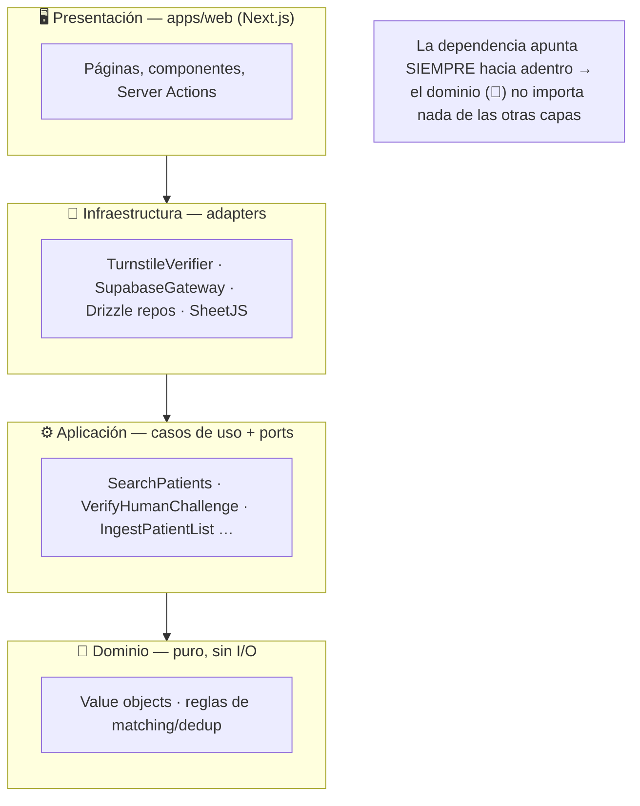
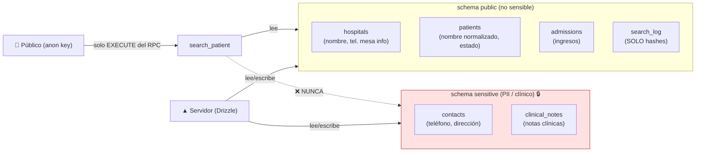
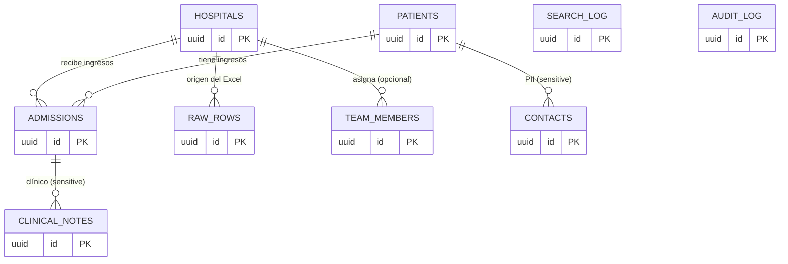

# EncuéntrameVzla — Arquitectura, flujos y glosario

Documento de referencia (no técnico-pesado) para entender **cómo funciona todo el sistema**:
qué piezas hay, cómo se comunican, qué es público y qué no, y un glosario de cada término.

> Regla de oro del proyecto: **privacidad mediada**. Una familia busca por nombre o cédula y
> solo recibe *"hay una coincidencia en el Hospital X — mesa de información: [tel]"*. Nunca datos
> personales del paciente.

---

## 1. ¿Tenemos una API? ¿Es pública? ¿Cómo nos comunicamos?

**No tenemos un backend ni una API REST propia.** No hay un servidor "nuestro" con endpoints tipo
`/api/buscar`. En su lugar:

- **Toda la base de datos es Supabase** (Postgres). No escribimos un backend; usamos las piezas que
  Supabase ya ofrece.
- La **única "puerta" pública a los datos** es **una función** de la base de datos: el **RPC**
  `search_patient`. No hay acceso directo a tablas desde el navegador.
- El **navegador del público nunca habla directo con la base de datos**. Desde el cambio anti-abuso,
  habla con una **Server Action** (código de servidor de Next.js que corre en Vercel), y esa Server
  Action es la que llama al RPC.

Hay **dos caminos de comunicación** muy distintos según quién use el sistema:

| | **Público (familias)** | **Equipo (admin / ingesta)** |
|---|---|---|
| Entra por | La home `/` | `/admin/*` (requiere login) |
| Se autentica | No (anónimo) | Sí (magic link de Supabase Auth) |
| Cómo llega a los datos | Server Action → **RPC `search_patient`** (con la *anon key*) | Conexión **directa a Postgres** (Drizzle) con credenciales de servidor |
| Qué puede ver | Solo el resultado mediado (hospital + teléfono) | Lo que su rol permita (cola de revisión, auditoría, etc.) |
| Puede tocar tablas | **No** (RLS lo prohíbe) | Sí, desde el servidor |

En resumen: **la "API pública" es una sola función de base de datos, mediada y blindada**, y se
accede a ella a través de nuestro propio código de servidor.

---

## 2. Vista general del sistema

**Cómo leerlo:** rojo = público/no confiable, azul = nuestro código de servidor, verde = Supabase.
El público (rojo) **nunca** toca el verde directamente: siempre pasa por el azul.

---

## 3. Flujo detallado: búsqueda pública (con anti-abuso)

Este es el camino completo cuando una familia busca a alguien.

**Puntos clave de privacidad en este flujo:**
- La **IP nunca se guarda en claro**: se convierte en un *hash* irreversible antes de tocar nada.
- En `search_log` solo se guarda el **hash del término** buscado (nunca el texto) y el tipo de
  resultado. No se puede reconstruir qué se buscó.
- El RPC solo lee del schema `public`; el schema `sensitive` (teléfonos, direcciones, notas
  clínicas) **no es accesible** por este camino.

---

## 4. Qué decide el RPC por dentro

> El **matching vive en SQL**, por eso se verifica con un *harness* de Node con transacción +
> ROLLBACK contra la base real (los tests normales de JavaScript no alcanzan el SQL).

---

## 5. Flujo: ingesta de listas (equipo / admin)

Cómo el equipo sube las listas de hospitales. Este camino **sí** escribe en la base, con
credenciales de servidor y autorización por rol.

> **Robustez (spec 0017).** La ingesta corre en dos fases: (1) todo el dedup en memoria
> generando los IDs con `newId()`, y (2) persistencia **bulk** (un INSERT multi-fila por tabla)
> dentro de una **transacción** vía el port `IngestionUnitOfWork`. Esto elimina el N+1 de
> escritura (de minutos a segundos, evitando el timeout serverless) y da atomicidad por archivo.

---

## 6. Arquitectura del código (Onion + Screaming)

El código se organiza en **capas concéntricas**: las de afuera dependen de las de adentro, nunca al
revés. El **dominio no conoce a nadie**.

- **Dominio** (`@evzla/core`): reglas puras (cómo se normaliza un nombre, cómo se compara). Sin
  internet, sin base de datos.
- **Aplicación**: los *casos de uso* (ej. `SearchPatients`) y los *ports* (interfaces que dicen
  "necesito algo que verifique humanos", sin saber que es Turnstile).
- **Infraestructura**: los *adapters* que cumplen esos ports usando tecnología real (Turnstile,
  Supabase, Drizzle, SheetJS).
- **Presentación**: Next.js (lo que el usuario ve) + el *composition root* que enchufa todo.

> Ventaja práctica: el día de mañana se puede cambiar Turnstile por otro proveedor tocando **solo**
> un adapter, sin tocar la lógica del buscador.

---

## 7. Fronteras de datos y privacidad

- El rol **anónimo** (`anon`) **no tiene permisos** sobre ninguna tabla; lo único que puede hacer es
  **ejecutar el RPC**. Por eso aunque la *anon key* sea pública, no sirve para sacar datos.
- El schema **`sensitive`** solo es accesible desde el **servidor** (conexión directa). Jamás se
  expone al navegador.

---

## 8. Modelo de datos (tablas y campos)

La base es **Postgres 16** en Supabase, partida en **dos schemas** por diseño de privacidad:
`public` (mostrable / no sensible) y `sensitive` (PII y clínico, aislado). El esquema lo define
Drizzle en `packages/db/src/schema/` y se materializa con las migraciones SQL de
`supabase/migrations/`.

### 8.1 Relaciones (diagrama entidad-relación)

> **Detalle clave:** un paciente **no** lleva el hospital "pegado". La relación vive en
> `admissions` (ingresos), y un paciente puede tener **varios** → así se modelan **traslados**
> sin perder el histórico. Las tablas de `sensitive` referencian a `public` por **FK lógica**
> (la integridad se refuerza en SQL, no con una FK física entre schemas).

### 8.2 Tipos enumerados

| Enum | Valores | Significado |
|---|---|---|
| `person_status` | `admitted` · `transferred` · `discharged` · `located` · `deceased` | Estado del paciente/ingreso: en el hospital · trasladado · dado de alta · **localizado** (la familia ya lo encontró, cierra el círculo) · fallecido (desde ADR-0003 también muestra ubicación). |
| `team_role` | `uploader` · `moderator` | Rol en `/admin`: subir listas · subir + revisar/fusionar + ver auditoría. |

### 8.3 Schema `public` (datos mostrables / no sensibles)

**`hospitals`** — instituciones hospitalarias.

| Campo | Tipo | Qué es |
|---|---|---|
| `id` | uuid (PK) | Identificador. |
| `name` | text · **NOT NULL** | Nombre del hospital (lo único de ubicación que ve el público). |
| `info_desk_phone` | text · null | **Único teléfono revelable**: la mesa de información. |
| `city` | text · null | Ciudad. |
| `active` | boolean · default `true` | Si está activo; el buscador solo considera hospitales activos. |

**`patients`** — la persona buscada.

| Campo | Tipo | Qué es |
|---|---|---|
| `id` | uuid (PK) | Identificador. |
| `normalized_name` | text · **NOT NULL** | Nombre normalizado (minúsculas, sin tildes) para el matching. |
| `name_tokens` | text[] · null | Palabras del nombre, para comparación token-set (dedup/matching). |
| `age` | integer · null | Edad (no se muestra al público). |
| `doc_type` | text · null | Tipo de documento (cédula, pasaporte…). |
| `normalized_doc_number` | text · null | Cédula/documento normalizado, para búsqueda exacta. |
| `status` | person_status · default `admitted` | Estado de la persona. |
| `is_minor` | boolean · default `false` | Si es menor de edad. |
| `created_at` | timestamptz · default now | Fecha de alta del registro. |

**`admissions`** — ingreso de un paciente en un hospital (la relación N↔N en el tiempo).

| Campo | Tipo | Qué es |
|---|---|---|
| `id` | uuid (PK) | Identificador. |
| `patient_id` | uuid · **NOT NULL** · FK→patients | Qué paciente. |
| `hospital_id` | uuid · **NOT NULL** · FK→hospitals | En qué hospital. |
| `admitted_at` | timestamptz · null | Cuándo ingresó. |
| `status` | person_status · default `admitted` | Estado de **este** ingreso (permite traslados). |
| `has_public_notes` | boolean · default `false` | Si hay notas mostrables (no clínicas). |
| `created_at` | timestamptz · default now | Alta del registro. |

**`raw_rows`** — copia CRUDA de cada fila del Excel subido (trazabilidad + idempotencia).

| Campo | Tipo | Qué es |
|---|---|---|
| `id` | uuid (PK) | Identificador. |
| `file_id` | uuid · **NOT NULL** | Agrupa las filas de una misma carga. |
| `content_hash` | text · **NOT NULL · UNIQUE** | Huella de la fila: evita reprocesar la misma dos veces (idempotencia). |
| `raw_row` | jsonb · **NOT NULL** | La fila original tal cual vino del Excel. |
| `hospital_id` | uuid · null · FK→hospitals | Hospital de origen. |
| `uploaded_by` | uuid · null | Quién la subió. |
| `created_at` | timestamptz · default now | Cuándo se subió. |

**`team_members`** — allow-list del portal `/admin` (quién puede entrar y con qué rol).

| Campo | Tipo | Qué es |
|---|---|---|
| `id` | uuid (PK) | Identificador. |
| `email` | text · **NOT NULL · UNIQUE** | Correo (minúsculas); se une con la sesión de Supabase Auth. |
| `role` | team_role · **NOT NULL** | `uploader` o `moderator`. |
| `hospital_id` | uuid · null · FK→hospitals | Hospital asignado (null = moderador global). |
| `active` | boolean · default `true` | Si la membresía está activa. |
| `created_at` | timestamptz · default now | Alta. |

**`audit_log`** — bitácora **append-only** de toda mutación (no se actualiza ni borra).

| Campo | Tipo | Qué es |
|---|---|---|
| `id` | uuid (PK) | Identificador. |
| `actor_id` | uuid · null | Quién hizo la acción. |
| `action` | text · **NOT NULL** | Qué hizo (ej. `ingest_patient_list`, `merge_patients`). |
| `entity` | text · **NOT NULL** | Sobre qué entidad. |
| `entity_id` | uuid · null | Id de la entidad afectada. |
| `payload` | jsonb · null | Detalle/contexto de la acción. |
| `created_at` | timestamptz · default now | Cuándo. |

**`search_log`** — anti-enumeración. Guarda **solo hashes**, jamás texto en claro.

| Campo | Tipo | Qué es |
|---|---|---|
| `id` | uuid (PK) | Identificador. |
| `term_hash` | text · **NOT NULL** | SHA-256 del término buscado (no reversible). |
| `result_type` | text · **NOT NULL** | `invalid_term` · `matches` · `no_results` · `rate_limited`. |
| `client_hash` | text · null | SHA-256 de la IP (+sal), para el rate-limit. *(Añadido en migr. 0007.)* |
| `created_at` | timestamptz · default now | Cuándo. |

> ⚠️ **Drift conocido a sincronizar:** la columna `client_hash` existe en la BD (migración 0007)
> pero todavía **no** está declarada en el schema Drizzle (`packages/db/src/schema/public.ts`).
> No rompe nada (esa columna la escribe el RPC en SQL, no Drizzle), pero conviene añadirla para
> que el esquema TypeScript refleje la realidad.

### 8.4 Schema `sensitive` (PII / clínico — AISLADO 🔒)

El rol anónimo **no tiene ningún grant** aquí. Solo el servidor (Drizzle, conexión directa) lo
toca. El RPC `search_patient` **jamás** lee de este schema.

**`sensitive.contacts`** — datos de contacto/PII del paciente.

| Campo | Tipo | Qué es |
|---|---|---|
| `id` | uuid (PK) | Identificador. |
| `patient_id` | uuid · **NOT NULL** · FK lógica→public.patients | A qué paciente. |
| `phone` | text · null | Teléfono personal **(nunca al público)**. |
| `address` | text · null | Dirección **(nunca al público)**. |

**`sensitive.clinical_notes`** — notas clínicas del ingreso.

| Campo | Tipo | Qué es |
|---|---|---|
| `id` | uuid (PK) | Identificador. |
| `admission_id` | uuid · **NOT NULL** · FK lógica→public.admissions | A qué ingreso. |
| `note` | text · null | Nota clínica **(nunca al público)**. |
| `arrived_with` | text · null | Con qué/quién llegó **(nunca al público)**. |

### 8.5 Por qué esta arquitectura de datos

- **Separación física `public`/`sensitive`**: aunque alguien comprometa la clave anónima, no
  alcanza la PII (está en otro schema sin grants).
- **`patients` ↔ `admissions` separados**: una persona puede ser trasladada; cada ingreso es una
  fila → histórico completo sin sobrescribir.
- **`raw_rows` con `content_hash` único**: subir el mismo Excel dos veces no duplica datos.
- **`audit_log` append-only**: todo cambio queda trazado para revisión humana.
- **`search_log` solo hashes**: se puede medir uso/abuso (volumen, `rate_limited`) sin saber **qué**
  ni **quién** buscó.

---

## 9. Glosario de términos

### Frontend y servidor

| Término | Qué es (en cristiano) |
|---|---|
| **Next.js** | El framework con el que está hecha la web (páginas, navegación, y también código de servidor). |
| **Vercel** | La plataforma donde está desplegada/alojada la web (hosting). |
| **App Router** | La forma moderna de Next.js de organizar páginas por carpetas. |
| **Server Component (RSC)** | Componente que se ejecuta **en el servidor** y manda HTML ya listo. No corre en el navegador. |
| **Client Component** | Componente que corre **en el navegador** (necesita interactividad: clicks, estados…). |
| **Server Action** ⭐ | Una **función de servidor** que el formulario llama directamente. Recibe los datos, hace cosas seguras (verificar Turnstile, leer la IP, llamar a la base) y devuelve el resultado. El navegador no ve esa lógica. **Es por donde pasa ahora la búsqueda.** |
| **Estática / `force-static` / ISR** | La home se genera una vez y se sirve desde la CDN (rapidísimo, sin gastar servidor). Se regenera sola cuando se sube una lista nueva (`revalidatePath('/')`). |
| **CDN** | Red de servidores repartidos por el mundo que sirven contenido estático muy rápido y cerca del usuario. |

### Base de datos y Supabase

| Término | Qué es |
|---|---|
| **Supabase** | El "backend como servicio": nos da Postgres, autenticación y APIs sin programar un servidor. |
| **Postgres** | La base de datos (donde viven hospitales, pacientes, ingresos…). |
| **PostgREST** | La capa de Supabase que convierte la base de datos en una API HTTP. Es lo que permite llamar al RPC por internet. |
| **RPC** ⭐ | *Remote Procedure Call*. Aquí significa **llamar a una función guardada dentro de la base de datos** (`search_patient`) como si fuera un endpoint. Es la única puerta pública a los datos. |
| **`search_patient`** | Nuestra función RPC: recibe el término, aplica rate-limit, busca de forma mediada y devuelve solo hospital + teléfono. |
| **RLS (Row Level Security)** | Reglas de Postgres que deciden quién puede ver/tocar qué filas. Aquí: el público no puede tocar ninguna tabla. |
| **SECURITY DEFINER** ⭐ | Hace que la función se ejecute con los **permisos de su dueño**, no los de quien la llama. Así el público (sin permisos) puede ejecutar la función, y la función —por dentro— sí puede leer las tablas necesarias, de forma controlada. |
| **anon key (clave anónima)** | Clave **pública** del proyecto Supabase. Identifica al "visitante anónimo". Por RLS, con ella **solo** se puede ejecutar el RPC, nada más. |
| **service role** | Clave **secreta** de máximos permisos. Solo en el servidor (ingesta/admin). Jamás en el navegador. |
| **Drizzle** | El ORM (traductor entre TypeScript y SQL) con el que el servidor habla directo con Postgres. |
| **schema `public` / `sensitive`** | Dos "cajones" separados de la base: `public` = datos mostrables; `sensitive` = PII y datos clínicos, aislados. |
| **`search_log`** | Bitácora anti-abuso: guarda **solo hashes** (del término y de la IP) + el tipo de resultado. Nunca texto en claro. |

### Anti-abuso

| Término | Qué es |
|---|---|
| **Cloudflare Turnstile** ⭐ | El reemplazo moderno y privado del CAPTCHA. Un widget que comprueba **de forma casi siempre invisible** que detrás hay una persona y un navegador real, no un script. |
| **Token (de Turnstile)** | Una cadena de un solo uso que el widget genera cuando cree que eres humano. Viaja con el formulario y el servidor la valida. |
| **siteverify** | El endpoint de Cloudflare al que nuestro servidor le pregunta "¿este token es válido?" usando la clave secreta. |
| **Modo Gestionado** | El modo de Turnstile que elegimos: Cloudflare decide el reto según el riesgo (invisible para la mayoría, desafío visible solo a sospechosos). |
| **Rate-limit (límite de frecuencia)** ⭐ | Tope de cuántas búsquedas puede hacer una misma fuente en una ventana de tiempo. El nuestro: **300 búsquedas / 10 minutos por IP**. |
| **Ventana deslizante** | El conteo mira "los últimos 10 minutos" en todo momento (no se reinicia a una hora fija); las búsquedas viejas van caducando y liberan cupo. |
| **Enumeración** ⭐ | El abuso que prevenimos: un script que prueba miles de nombres/cédulas en automático para descargarse toda la base. |
| **Hash / SHA-256** ⭐ | Una "huella digital" irreversible de un dato. Del hash no se puede volver al original. Lo usamos para term y para la IP. |
| **Sal (salt)** | Una cadena secreta que se mezcla con la IP antes de hashearla, para que el hash no se pueda adivinar por fuerza bruta. |
| **NAT / IP compartida** | Varias personas tras el mismo WiFi salen a internet con **una sola IP pública**. Por eso el límite por IP se puso generoso (300): para no bloquear a familias que comparten red. |
| **x-forwarded-for** | La cabecera HTTP donde Vercel nos dice la IP real del visitante. |

### Autenticación y dominio

| Término | Qué es |
|---|---|
| **Supabase Auth / Magic link** | Login sin contraseña: el equipo recibe un **enlace de un solo uso** en su correo para entrar. |
| **team_members** | La tabla con los correos del equipo y su rol (quién puede subir listas, revisar, etc.). |
| **DNS / Cloudflare** | El dominio `encuentramevzla.com` se registra en AWS pero su DNS lo gestiona **Cloudflare**, que apunta a Vercel. |

---

## 10. Reglas innegociables (recordatorio)

1. El schema **`sensitive` jamás** llega al cliente.
2. El público **solo** accede vía el RPC `search_patient`.
3. `search_log` guarda **solo hashes**, nunca el término en claro.
4. Anti-abuso: **Turnstile** (humanidad) + **rate-limit 300/10min** (frecuencia).
5. Nada de `npm` (siempre `pnpm`); código en inglés, comentarios cortos en español.

> Nota: existe una excepción documentada (ADR-0003) — el buscador hoy **sí** muestra la ubicación de
> menores y fallecidos, por decisión humana explícita del dueño del dato.
